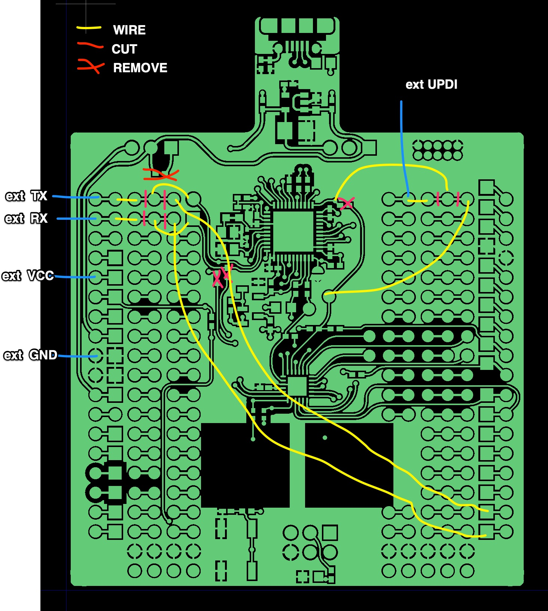
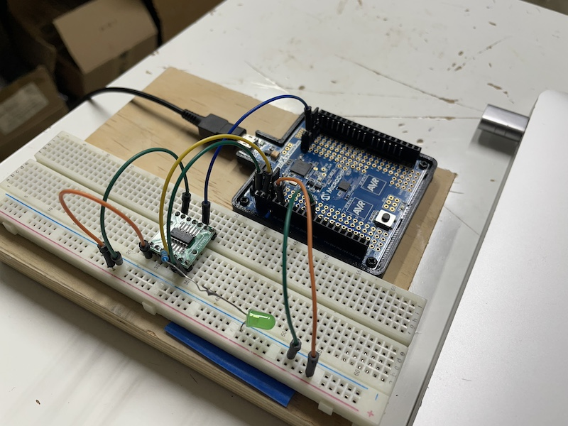

# HOW-TO modify ATtiny817 Xplained Mini devboard for external target

1. Make hardware modifications as shown here 

* Cut traces
* Remove 0 Ohm resistors
* Solder headers
* Solder wires

## Results

Serial terminal works
Remote debugging works (in MPLABx)