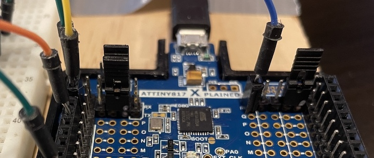
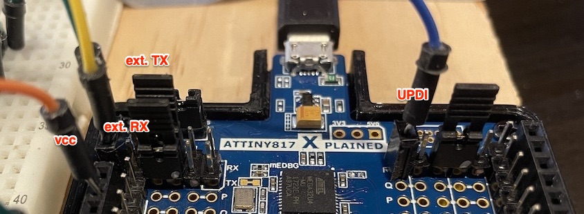
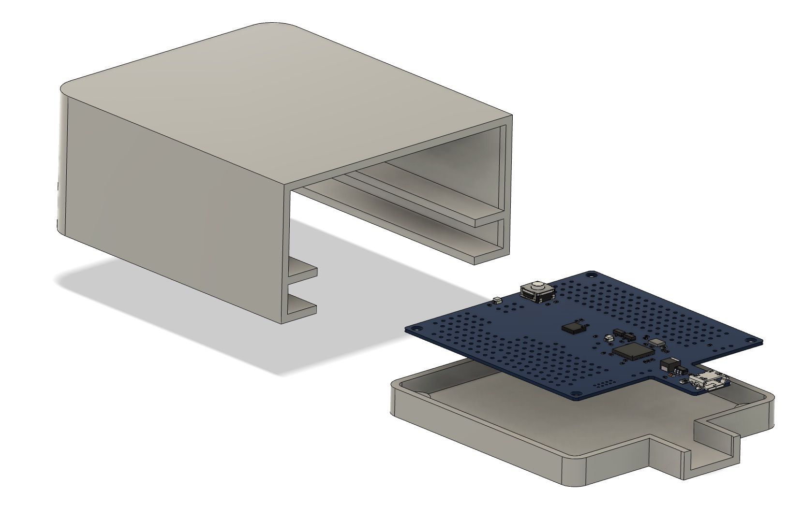

# HOW-TO modify ATtiny817 Xplained Mini devboard for external target

1. Make hardware modifications as shown here 

* Cut traces
* Remove 0 Ohm resistors
* Solder headers
* Solder wires

## Results

Serial terminal works. 
Remote debugging works (in MPLABx only)

## For internal target MCU 
i.e. for ATTiny817 on the devboard, move all 3 jumpers to the right position. Notice the white dots.

## For external target MCU 
Move all 3 jumpers to the left position

## Enclosure

See [enclosure.step](enclosure.step)